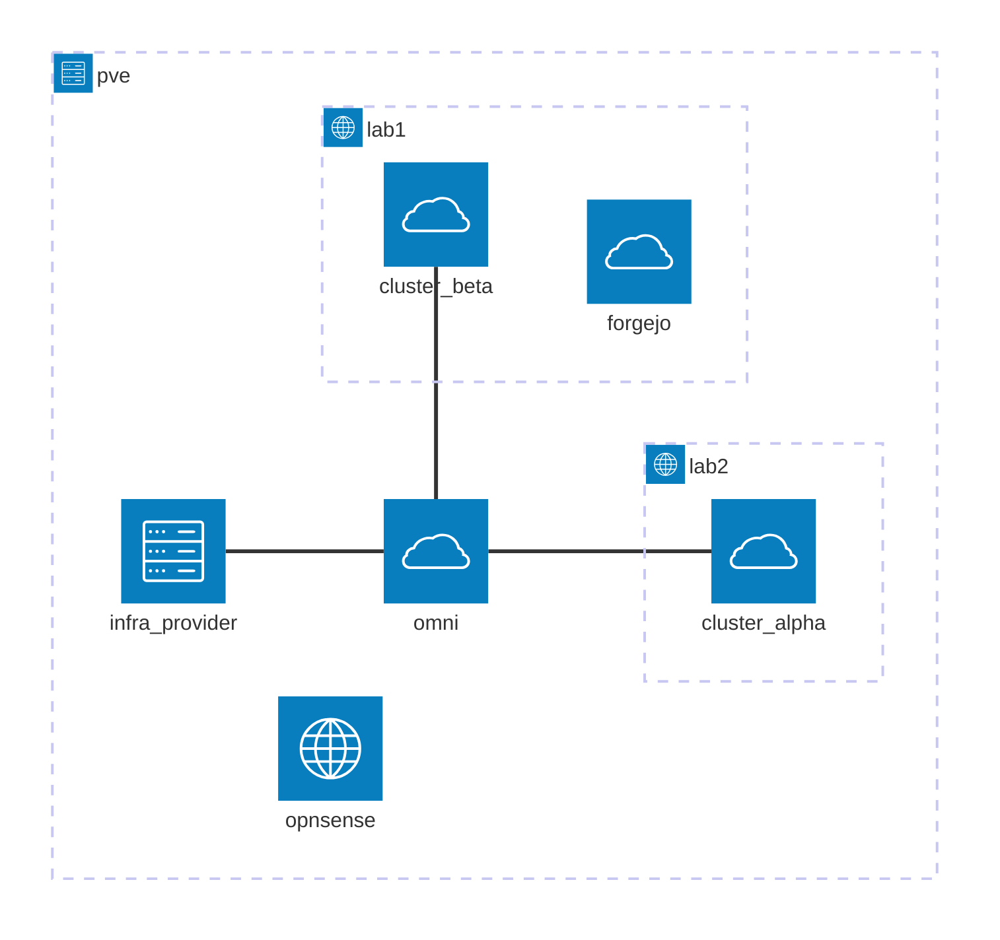

# Homelab GitOps repository

Version-controlled definitions of what's deployed in my homelab, running on a repurposed workstation behind my fridge.

I'm a software engineer. Little attention has been (or will be) paid on optimal hardware, or network setup: My goal is simply to have an as-complete-as-possible cloud Kubernetes sandbox with the least effort possible. I'm mainly interested in what comes after I get a kubeconfig.

I like to keep things reproducible. Therefore, I try to keep all versions of everything installed in the clusters in git by either making Kustomizations with remote resources or setting up Helm subcharts. With ArgoCD in place, having dangling Helm releases in the clusters would only confuse things, hence the choice for no `helm install` in this project and keeping everything except the load balancer setup in an app-of-apps pattern.

## Foundations: Simple stability

| Component              | Purpose                                               |
| ---------------------- | ----------------------------------------------------- |
| Proxmox                | Hypervisor + NFS storage                              |
| OPNsense               | Virtual router managing VLANs, DNS, and connectivity  |
| Tailscale              | Remote access                                         |
| Debian+Docker          | Hosting infrastructure tools such as Omni and Forgejo |
| Omni                   | Easier managing of Talos clusters                     |
| Proxmox Infra Provider | Automated provisioning of Talos nodes                 |
| Forgejo                | Locally hosted git to bootstrap from                  |

## Clusters: All cattle, no pets

I currently operate two 3+3 node clusters, each designated for a different type of connectivity: one which I can expose to friends&family via a reverse proxy, and one which is only accessible from my tailnet. Both clusters are managed declaratively with Omni.

## Network architecture

VLANs and firewall rules are defined in OPNsense. Proxmox SDN makes it easier to allocate each VM a NIC in the correct network. The host, the firewall, and one infra VM get access to the trunk. The rest will go in VLANs.



## Setup

If you want to run my clusters, here's how. This also serves as documentation for my future self in case I need to rebuild.

### Prerequisites

- omnictl
- kubectl
- Helm

### From bare metal to Omni and Forgejo

A (very) high level walkthrough:

1. Install Proxmox
2. Create three VMs: OPNsense and two Debians
3. Define VLANs in OPNsense and Proxmox SDN; one of the Debians gets a NIC in the host LAN
4. Install Docker on the Debian VMs
5. Set up certbot, Omni, and the infra provider on the VM with host access
6. Deploy the clusters from `./omni-clusters` with omnictl
7. Set up Forgejo on the second VM and mirror this repository there

The rest of the steps in this setup are to be repeated for each cluster in the system.

### LoadBalancer support with MetalLB

MetalLB is really designed for bare metal environments, but gets the job done in Proxmox just fine, too.

1. Ensure network connectivity from your workstation to the network where the nodes will be created. E.g. set up a VPN tunnel to the router and allow traffic from that tunnel to the cluster network.

2. Once the nodes are up, assign static IPs to each on the router and add them as BGP neighbours for the MetalLB setup as per the [OPNsense docs](https://docs.opnsense.org/manual/dynamic_routing.html#bgp-section), with help from [this guide](https://github.com/bug1510/metallb-bgp-opnsense-deployment).

3. Install MetalLB to support creating LoadBalancer services in the cluster.

   ```
   kubectl apply -k metallb/installation/overlays/<cluster>
   ```

4. Allow it a little bit of time to settle in, then apply the BGP setup.

   ```
   kubectl wait --for condition=Ready pod -l app=metallb -n metallb-system
   kubectl apply -k metallb/configuration/overlays/<cluster>
   ```

   Check the result with:

   ```
   kubectl logs -n metallb-system -l component=speaker --tail=50
   ```

   The cluster is now ready to assign external IPs to LoadBalancer services.

### Install ArgoCD

ArgoCD's' CRDs exceed the size limit for `kubectl apply`, so `--server-side` is needed. `--force-conflicts` is needed for reliable upgrades, so I'll include it already.

```
helm dep update argocd
helm template argocd argocd -n argocd -f argocd/environments/values-<cluster>.yaml | kubectl apply --server-side --force-conflicts -f -
```

Wait for the pods to spin up and get the admin password:

```
kubectl wait --for condition=Ready pod -l app.kubernetes.io/part-of=argocd -n argocd
kubectl get secret argocd-initial-admin-secret -n argocd -o jsonpath="{.data.password}" | base64 -d
```

Use the IP address of the ArgoCD service to access the tool. Change the admin password.

### Deploy App of Apps

Kick off the GitOps loop with:

```
helm template root-app -f root-app/environments/values-<cluster>.yaml | kubectl apply -f -
```

The root-app will also watch itself, so any new applications should be registered automatically.

See if everything spins up:

```
kubectl logs -l app=test-deployment -n helloworld
curl 10.0.140.11
curl 10.0.140.12
```

### Cluster-level cert management

I have a custom cronjob to keep my private-facing certificates fresh, with mild inspiration from [this solution](https://github.com/nabsul/k8s-letsencrypt). I use deSEC for DNS and make use of DNS-01 with [zone delegation](https://letsencrypt.org/docs/challenge-types/#dns-01-challenge). It's not pretty, it gets the job done, it's hopefully one of those temporary solutions that don't actually ever need any further attention.

To get started, for lack of a better secrets management system, put the deSEC token into a gitignored values.yaml file and apply it to the cluster:

```
helm template secrets -f private/acme-creds.yaml | kubectl apply -f -
```

The certbot job is idempotent (though beware of Let's Encrypt rate limits - try first with the staging flag set). Launch it once manually to create the first certificate, either from the ArgoCD UI or by running:

```
kubectl create job certbot-initial --from cronjob/certbot -n cronjobs
```

...unless it's exactly Sunday 2pm, in which case the job will already be running on its own. I was making this at exactly 2pm UTC on a Sunday, on literally the same second, and believe me I was confused.

Create the relevant A records as Unbound DNS overrides in OPNsense and test with:

```
curl https://argocd-beta.konstakanniainen.dev
```

The padlock is happy, we're good to go. Traefik endpoints should also automatically have access to the certificate. Test it with:

```
curl https://hello-beta.konstakanniainen.dev
```
