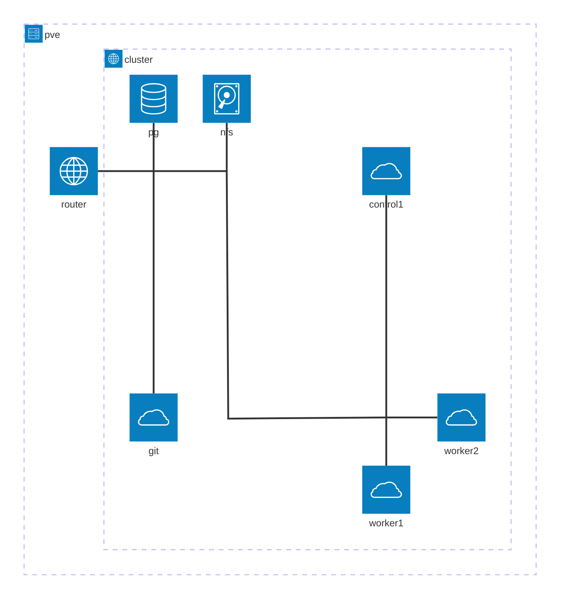

# Homelab GitOps repository

Bootstrap-ready definitions of what's deployed in my homelab of two clusters, running on a repurposed workstation behind my fridge. This is my playground to try out different components and patterns before applying them in production.

## Infrastructure stack

| Component   | Version |
| ----------- | ------- |
| OPNsense    | 26.1.4  |
| Talos Linux | 1.12.5  |
| talosctl    | 1.12.5  |
| kubectl     | 1.35.3  |
| Kustomize   | 5.7.1   |
| Kubernetes  | 1.35.2  |
| Helm        | 4.1.3   |

The rest of the versions are pinned in the respective Helm subcharts or kustomizations.

## Clusters

### Alpha

"DMZ" cluster serving as application platform for publicly exposed services. Currently 1+2 nodes. There's [another reverse proxy](https://pangolin.net/) in front of this cluster, so Traefik doesn't need certs.

### Beta

"Main" cluster serving as a hub with ArgoCD and certificate management. Currently 3+2 nodes. Only accessible from my network.

## Architecture



## My setup: Multiple clusters managed via one ArgoCD instance (hub and spoke)

If you want to run my cluster setup, here's how. This also serves as documentation for my future self in case I need to rebuild.

### Prerequisites

- kubectl
- Helm
- Kubernetes cluster(s) with cloud load balancer support. I currently use [Talos Linux](https://docs.siderolabs.com/talos/v1.12/overview/what-is-talos), [OPNsense](https://opnsense.org/), and [MetalLB](https://metallb.io/) on [Proxmox](https://www.proxmox.com/en/products/proxmox-virtual-environment/overview) to achieve this, your setup may be fancier.
- A git repository accessible via http(s) - github will do, I use gitea/forgejo internally.

#### If starting from scratch: Network setup with MetalLB

For each cluster in the system,

1. Ensure network connectivity from your workstation to the network where the nodes will be created. E.g. set up a VPN tunnel to the router and allow traffic from that tunnel to the cluster network.

2. After installing the Talos image on each node, assign static IPs on the router and add them as BGP neighbours for the MetalLB setup as per the [OPNsense docs](https://docs.opnsense.org/manual/dynamic_routing.html#bgp-section), with help from [this guide](https://github.com/bug1510/metallb-bgp-opnsense-deployment).

3. Bootstrap a Talos cluster as per the [docs](https://docs.siderolabs.com/talos/v1.12/getting-started/getting-started).

4. Install MetalLB to support creating LoadBalancer services in the cluster.

   ```
   kubectl apply -k metallb/installation/overlays/cluster-***
   ```

5. Allow it a little bit of time to settle in, then apply the BGP setup.

   ```
   kubectl wait --for condition=Ready pod -l app=metallb -n metallb-system
   kubectl apply -k metallb/configuration/overlays/cluster-***
   ```

   The cluster is now ready to assign external IPs to LoadBalancer services.

### Notes

I like to keep things reproducible. Therefore, I try to keep all versions of everything installed in the clusters in git by either making Kustomizations with remote resources or setting up Helm subcharts. With ArgoCD in place, having dangling Helm releases in the clusters would only confuse things, hence the choice for no `helm install` in this project and keeping everything except the load balancer setup in an app-of-apps pattern.

Hosting the homelab repo itself in-cluster is out of scope for practical purposes at this time. [Forgejo isn't HA-ready anyway](https://code.forgejo.org/forgejo-helm/forgejo-helm/src/branch/main/docs/ha-setup.md), so for now it can stay on a separate docker host.

### Install ArgoCD on the main cluster (hub)

ArgoCD's' CRDs exceed the size limit for `kubectl apply`, so `--server-side` is needed. `--force-conflicts` is needed for reliable upgrades, so I'll include it already.

```
helm dep update argocd
helm template argocd argocd -n argocd | kubectl apply --server-side --force-conflicts -f -
```

Wait for the pods to spin up and get the admin password:

```
kubectl wait --for condition=Ready pod -l app.kubernetes.io/part-of=argocd -n argocd
kubectl get secret argocd-initial-admin-secret -n argocd -o jsonpath="{.data.password}" | base64 -d
```

### Add the dmz cluster (spoke)

Ensure the API server endpoint of the spoke cluster is reachable from the main cluster nodes as well as from your workstation.

```
argocd login 192.168.3.11
argocd cluster add admin@talos-cluster-alpha
```

### Install App of Apps on the main cluster

Kick off the GitOps loop with:

```
helm template root-app | kubectl apply -f -
```

The root-app will also watch itself, so any new applications should be registered automatically.

See if everything spins up:

```
kubectl logs -l app=test-deployment -n helloworld
curl 192.168.3.10
curl 10.2.2.10
```

### Configure certbot

I have a custom cronjob to keep my main cluster's certificates fresh, with mild inspiration from [this solution](https://github.com/nabsul/k8s-letsencrypt). I use deSEC for DNS and make use of DNS-01 with [zone delegation](https://letsencrypt.org/docs/challenge-types/#dns-01-challenge).

To get started, for lack of a better secrets management system, put the deSEC token into a hidden values.yaml file and apply it to the cluster:

```
helm template secrets -f private/acme-creds.yaml | kubectl apply -f -
```

The certbot job is idempotent (though beware of Let's Encrypt rate limits). Launch it once manually to create the first certificate, either from the ArgoCD UI or by running:

```
kubectl create job certbot-initial --from cronjob/certbot
```

...unless it's exactly Sunday 2pm, in which case the job will already be running on its own. I was making this at exactly 2pm UTC on a Sunday, on literally the same second, and believe me I was confused.

Create the relevant A records in Unbound DNS and test with:

```
curl https://argocd.konstakanniainen.dev
```

The padlock is happy, we're good to go. Traefik endpoints should also automatically have access to the certificate. Test it with:

```
curl https://hello-beta.konstakanniainen.dev
```
