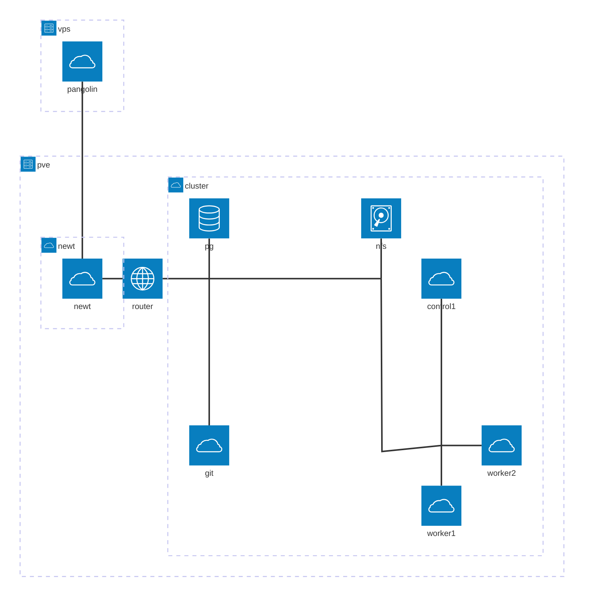

# Homelab GitOps repository

Bootstrap-ready definitions of what's deployed in my home cluster of 1 control plane node and 2 worker nodes, running on a repurposed workstation behind my fridge. This is my playground to try out different components and patterns before applying them in production clusters.

## Infrastructure stack

| Component   | Version |
| ----------- | ------- |
| OPNsense    | 26.1.4  |
| Talos Linux | 1.12.5  |
| talosctl    | 1.12.5  |
| kubectl     | 1.35.3  |
| Kustomize   | 5.7.1   |
| Kubernetes  | 1.35.2  |
| Helm        | 4.1.3   |

The rest of the versions are pinned in the respective Helm subcharts or kustomizations.

## Architecture



## Bootstrap a cluster

### Prerequisites

- kubectl
- Helm
- Kubernetes cluster with cloud load balancer support (I use [Talos Linux](https://docs.siderolabs.com/talos/v1.12/overview/what-is-talos), [OPNsense](https://opnsense.org/), and [MetalLB](https://metallb.io/) on [Proxmox](https://www.proxmox.com/en/products/proxmox-virtual-environment/overview) to achieve this)

#### If starting from scratch: Network setup with MetalLB

1. After installing the Talos image on each node, assign static IPs on the router and add them as BGP neighbours for the MetalLB setup as per the [OPNsense docs](https://docs.opnsense.org/manual/dynamic_routing.html).

2. Install MetalLB to support creating LoadBalancer services in the cluster.

   ```
   kubectl apply -k metallb/installation
   ```

3. Allow it a little bit of time to settle in, then apply the BGP setup with

   ```
   kubectl apply -k metallb/configuration
   ```

   The cluster is now ready to assign external IPs to LoadBalancer services.

### Notes

I like to keep things reproducible. Therefore, I try to keep all versions of everything installed in the cluster in git by either making Kustomizations with remote resources or setting up Helm subcharts. With ArgoCD in place, having dangling Helm releases in the cluster would only confuse things, hence the choice for no `helm install` in this project.

Hosting the homelab repo itself in the cluster is out of scope for practical purposes at this time. Having it on a separate machine makes deploying new clusters much easier, and [Forgejo isn't HA-ready anyway](https://code.forgejo.org/forgejo-helm/forgejo-helm/src/branch/main/docs/ha-setup.md), so for now it can stay on a separate docker host.

### Install ArgoCD and start the GitOps loop

ArgoCD's' CRDs exceed the size limit for `kubectl apply`, so `--server-side` is needed. `--force-conflicts` is needed for reliable upgrades, so I'll include it already.

```
helm dep update argocd
helm template argocd argocd -n argocd | kubectl apply --server-side --force-conflicts -f -
```

Wait for the pods to spin up and get the admin password:

```
kubectl get pods -n argocd -w
kubectl get secret argocd-initial-admin-secret -n argocd -o jsonpath="{.data.password}" | base64 -d
```

Kick off the GitOps process with:

```
helm template root-app | kubectl apply -f -
```

### Test everything with:

```
kubectl logs -n helloworld pod/test-pod
curl 10.2.2.10
```

### External access

I have Pangolin installed on an external VPS, where my public DNS records are also pointed. The wireguard tunnel terminates behind the OPNsense router, so additionally port forwarding needs to be set up for the tunnel to reach the load balancer(s).

## TODO

### Storage

For now, since everything happens on the same machine, I'll use a single storage VM serving NFS. In the future, it might make sense to add a cloud native storage solution like Longhorn or Piraeus.

### Database

In a similar fashion, to get things moving, I'll make use of a non-HA, centralised database server. I'll use PostgreSQL since it's a very common requirement of various applications, and paves way for a possible future CloudNativePG deployment.
