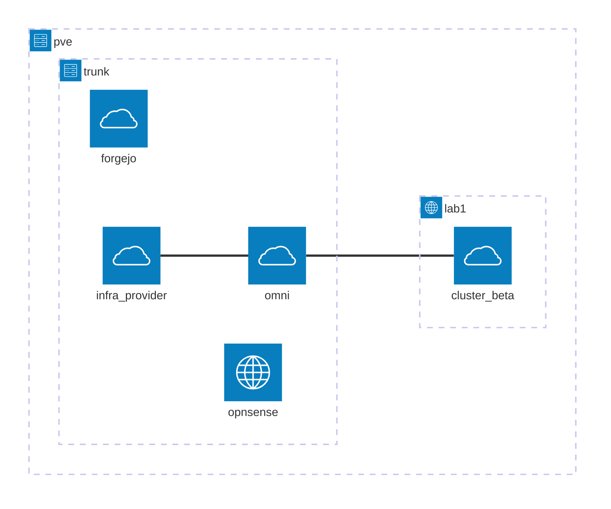

# Homelab GitOps repository

Version-controlled definitions of what's deployed in my homelab, running on a repurposed HP Z440 workstation.

I'm a software engineer. Little attention has been (or will be) paid on optimal hardware, or network setup: My goal is simply to have an as-complete-as-possible cloud Kubernetes sandbox with the least effort possible. I'm mainly interested in what comes after I get a kubeconfig.

I like to keep things reproducible. Therefore, I try to keep all versions of everything installed in the clusters in git by either making Kustomizations with remote resources or setting up Helm subcharts. With ArgoCD in place, having dangling Helm releases in the clusters would only confuse things, hence the choice for no `helm install` in this project and keeping everything except the load balancer setup in an app-of-apps pattern.

## Foundations: Simple stability

| Component              | Purpose                                               |
| ---------------------- | ----------------------------------------------------- |
| Proxmox                | Hypervisor + NFS storage                              |
| OPNsense               | Virtual router managing VLANs, DNS, and connectivity  |
| Tailscale              | Remote access                                         |
| Debian+Docker          | Hosting infrastructure tools such as Omni and Forgejo |
| Omni                   | Easier managing of Talos clusters                     |
| Proxmox Infra Provider | Automated provisioning of Talos nodes                 |
| Forgejo                | Locally hosted git to bootstrap from                  |

## Clusters: All cattle, no pets

I recently downsized from two to one 3+3 node cluster to cut down on management overhead and compute resources. The pattern stays the same: Everything in git, Omni, cluster templates, ArgoCD app-of-apps. These architecture decisions have already proven themselves as I have played around, recycled all of the nodes without ever shutting down the cluster, going from 3 control plane nodes to 5 and back again, getting up close and familiar with the cluster templating.

One note that I will leave for anyone who considers the same setup: Try something else than OPNsense+MetalLB-BGP for routing. I had a hard time automating node IP changes and ended up updating them manually in OPNsense each time a new node was provisioned. I have since heard that Cilium might be a better pick over MetalLB. Maybe I'll try it at some point. This current setup works fine otherwise so I'm not in a rush to switch, just need to remember this one footgun.

## Network architecture

VLANs and firewall rules are defined in OPNsense. Proxmox SDN makes it easier to allocate each VM a NIC in the correct network. The host, the router, and the infra VM get access to the trunk. The rest will go in VLANs. Additionally, there's a completely separate bridge serving NFS shares from the host to the worker nodes for bulk media and backup storage.

I have Pangolin installed on an external VPS, where my public DNS records are also pointed. By installing Newt in the cluster, we can expose its services to the internet through Pangolin in addition to the local Traefik.


```mermaid
architecture-beta
    group pve(server)[pve]
    group trunk(server)[trunk] in pve

    service opnsense(internet)[opnsense] in trunk

    service infra_provider(cloud)[infra_provider] in trunk
    service omni(cloud)[omni] in trunk
    service forgejo(cloud)[forgejo] in trunk

    group lab1(internet)[lab1] in pve

    service cluster_beta(cloud)[cluster_beta] in lab1

    infra_provider:R -- L:omni
    omni:R -- L:cluster_beta
```

## Setup

If you want to run my setup, here's how. This also serves as documentation for my future self in case I need to rebuild.

### Prerequisites

- omnictl
- kubectl
- Helm

### From bare metal to Omni and Forgejo

A (very) high level walkthrough:

1. Install Proxmox
2. Create two VMs: OPNsense and some Linux with Docker
3. Define VLANs in OPNsense and Proxmox SDN; the Linux VM gets a NIC in the host LAN
4. Configure ACME cert automation in Proxmox with necessary automations to deploy the certs to the Docker VM
5. Set up Forgejo on the VM and mirror this repository there
6. Setup Omni and the infra provider on the VM
7. Deploy the cluster(s) from `./omni-clusters` with omnictl

The rest of the steps in this setup are to be repeated for each cluster in the system.

### LoadBalancer support with MetalLB

MetalLB is really designed for bare metal environments, but gets the job done in Proxmox just fine, too.

1. Ensure network connectivity from your workstation to the network where the nodes will be created. E.g. set up a VPN tunnel to the router and allow traffic from that tunnel to the cluster network.

2. Once the nodes are up, assign static IPs to each on the router and add them as BGP neighbours for the MetalLB setup as per the [OPNsense docs](https://docs.opnsense.org/manual/dynamic_routing.html#bgp-section), with help from [this guide](https://github.com/bug1510/metallb-bgp-opnsense-deployment).

3. Install MetalLB to support creating LoadBalancer services in the cluster.

   ```
   kubectl apply -k metallb/installation
   ```

4. Allow it a little bit of time to settle in, then apply the BGP setup.

   ```
   kubectl wait --for condition=Ready pod -l app=metallb -n metallb-system
   kubectl apply -k metallb/configuration/overlays/<cluster>
   ```

   Check the result with:

   ```
   kubectl logs -n metallb-system -l component=speaker --tail=50
   ```

   The cluster is now ready to assign external IPs to LoadBalancer services.

### Install ArgoCD

ArgoCD's' CRDs exceed the size limit for `kubectl apply`, so `--server-side` is needed. `--force-conflicts` is needed for reliable upgrades, so I'll include it already.

```
helm dep update argocd
helm template argocd argocd -n argocd | kubectl apply --server-side --force-conflicts -f -
```

Wait for the pods to spin up and get the admin password:

```
kubectl wait --for condition=Ready pod -l app.kubernetes.io/part-of=argocd -n argocd
kubectl get secret argocd-initial-admin-secret -n argocd -o jsonpath="{.data.password}" | base64 -d
```

Use the IP address of the ArgoCD service to access the tool. Change the admin password.

### Namespaces and secrets

Create necessary namespaces so that we can pre-supply some secrets to the cluster:

```
kubectl create ns cronjobs
kubectl create ns longhorn-system
```

For lack of a better secrets management system, put the deSEC token and Authentik's secrets into a gitignored values.yaml file and apply it to the cluster:

```
helm template secrets -f private/credentials.yaml | kubectl apply -f -
```

### Deploy App of Apps

Kick off the GitOps loop with:

```
helm template root-app | kubectl apply -f -
```

The root-app will also watch itself, so any new applications should be registered automatically.

See if everything spins up:

```
curl 10.0.140.11
curl 10.0.140.12
```

### Cluster-level cert management

I have a custom cronjob to keep my private-facing certificates fresh, with mild inspiration from [this solution](https://github.com/nabsul/k8s-letsencrypt). I use deSEC for DNS and make use of DNS-01 with [zone delegation](https://letsencrypt.org/docs/challenge-types/#dns-01-challenge) for my other domain. It's not pretty, it gets the job done, it's hopefully one of those temporary solutions that don't actually ever need any further attention.

The certbot job is idempotent (though beware of Let's Encrypt rate limits - try first with the staging flag set). Launch it once manually to create the first certificate, either from the ArgoCD UI or by running:

```
kubectl create job certbot-initial --from cronjob/certbot -n cronjobs
```

...unless it's exactly Sunday 2pm, in which case the job will already be running on its own. I was making this at exactly 2pm UTC on a Sunday, on literally the same second, and believe me I was confused.

Create the relevant A records as Unbound DNS overrides in OPNsense and test with:

```
curl https://argocd.kohmis.fi
```

The padlock is happy, we're good to go. Traefik endpoints should also automatically have access to the certificate. Test it with:

```
curl https://hello.kohmis.fi
```

### PVC recovery

This setup uses Longhorn for storage. In need of disaster recovery:

1. Use feature flags to turn off services that require persistence
2. Deploy the rest of the cluster to access Longhorn and restore the Volumes.
3. Restore the PVs into the cluster.
4. If the PV was already in the cluster, but in the Released state, it needs to be made Available:

   ```
   kubectl patch pv pvc-c4787398-a167-4fff-a262-0ef2df254443 -p '{"spec":{"claimRef": null}}'
   ```

5. Modify the PV names in Helm values as needed
6. Turn the services back on. The PVCs should be created automatically and bound to the PVs.

If setting up a pristine cluster, create new PVCs as required by each service. For example, remove the existingClaim rows from jellyfin's values.yaml, and it will create new volumes automatically. Once you have the volume names, plug them into values.yaml and redeploy to see that it now uses those pre-defined PVCs.
